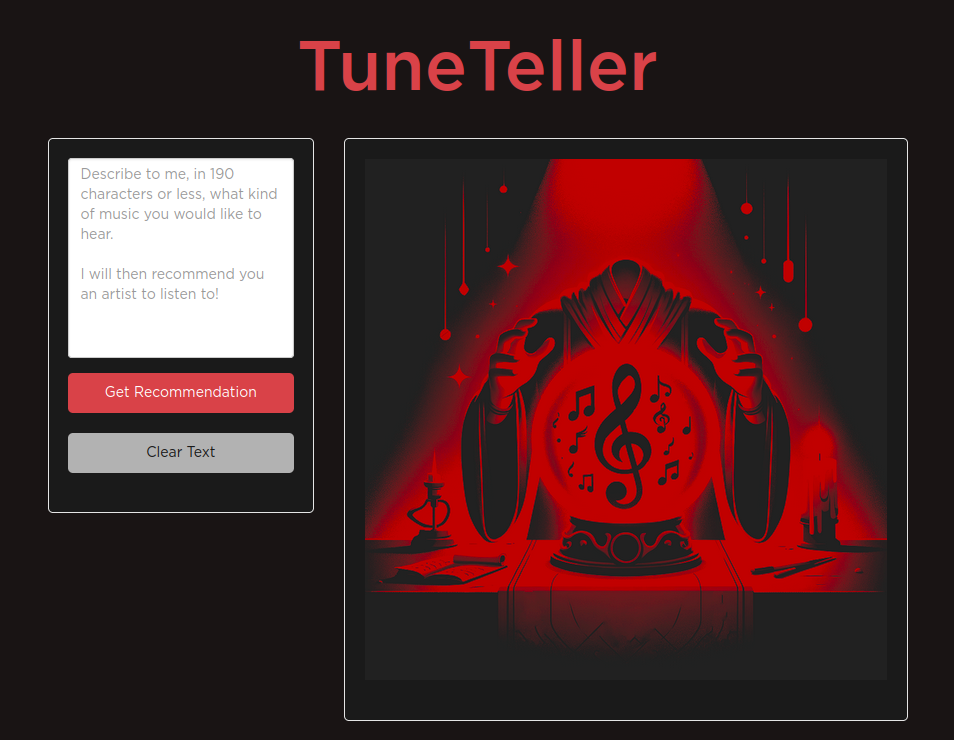

# 🎵 TuneTeller

**TuneTeller** is a Shiny web app that recommends music artists based on natural language prompts. Describe the kind of music you're in the mood for, and TuneTeller uses OpenAI to understand your request and Spotify to find the perfect artist match.

## 🔍 Features

- 🤖 Natural language music recommendations powered by OpenAI (GPT-4o-mini)
- 🎧 Artist details fetched from Spotify API (image, followers, profile link)
- ✍️ Simple text prompt interface (190 character limit)
- 🎨 Clean, dark-themed UI with Spotify-inspired styling
- 🔗 Direct link to artist's Spotify profile
- ⚡ Loading spinner while fetching recommendations

## 📸 Screenshot



## 🚀 Live App

👉 [Try it live on shinyapps.io](https://youcanbeapirate.shinyapps.io/TuneTeller/)

## 🛠️ Project Structure

```
music_recommender/
├── app/
│   ├── run.R                    # App entry point
│   ├── server.R                 # Server logic (OpenAI + Spotify API calls)
│   ├── ui.R                     # UI definition
│   └── www/
│       ├── favicon.png          # Browser tab icon
│       ├── placeholder_image.png # Default image before recommendation
│       ├── prompt_versions.R    # OpenAI prompt templates
│       └── styles.css           # Custom dark theme styles
├── deploy_app.R                 # Deployment script for shinyapps.io
├── img/                         # Images for documentation
├── renv.lock                    # Package dependencies lock file
└── renv/                        # renv package management
```

## 🔄 How It Works

1. **User Input**: You describe the music you want in a text prompt (up to 190 characters).
2. **OpenAI Processing**: The prompt is sent to GPT-4o-mini, which interprets your request and suggests an artist.
3. **Spotify Lookup**: The recommended artist is searched on Spotify to fetch their profile image, follower count, and profile URL.
4. **Display**: The artist card is rendered with all details and a direct link to their Spotify page.

## 🔐 API Keys Required

This app requires API keys from both OpenAI and Spotify:

| Variable | Description |
|----------|-------------|
| `OPENAI_API_KEY` | Your OpenAI API key |
| `SPOTIFY_CLIENT_ID` | Spotify Developer app client ID |
| `SPOTIFY_CLIENT_SECRET` | Spotify Developer app client secret |

Set these as environment variables or in a `.Renviron` file.

## 🧪 Local Development

```r
# Install dependencies
renv::restore()

# Set environment variables (or use .Renviron)
Sys.setenv(OPENAI_API_KEY = "your-key")
Sys.setenv(SPOTIFY_CLIENT_ID = "your-client-id")
Sys.setenv(SPOTIFY_CLIENT_SECRET = "your-client-secret")

# Run app locally
shiny::runApp("app/")
```

## 🔐 Deployment

This project uses rsconnect to deploy to shinyapps.io:

```r
source("deploy_app.R")
```

Secrets are passed through environment variables configured in shinyapps.io dashboard.

## 📦 Required R Packages

- [dplyr](https://dplyr.tidyverse.org/) - Data manipulation
- [httr2](https://httr2.r-lib.org/) - HTTP requests to OpenAI API
- [jsonlite](https://github.com/jeroen/jsonlite) - JSON parsing
- [purrr](https://purrr.tidyverse.org/) - Functional programming helpers
- [shiny](https://shiny.posit.co/) - Web application framework
- [shinyBS](https://ebailey78.github.io/shinyBS/) - Bootstrap components
- [shinycssloaders](https://daattali.com/shiny/shinycssloaders-demo/) - Loading spinners
- [spotifyr](https://www.rcharlie.com/spotifyr/) - Spotify API wrapper
- [stringr](https://stringr.tidyverse.org/) - String manipulation

## 🎨 Tech Stack

| Component | Technology |
|-----------|------------|
| Language | R |
| Framework | Shiny |
| AI | OpenAI GPT-4o-mini |
| Music Data | Spotify Web API |
| Styling | Custom CSS (dark theme) |
| Deployment | shinyapps.io |

## 📄 License

[MIT](https://opensource.org/license/mit)

## 👤 Author

Created by [Antti Rask](https://anttirask.github.io)
